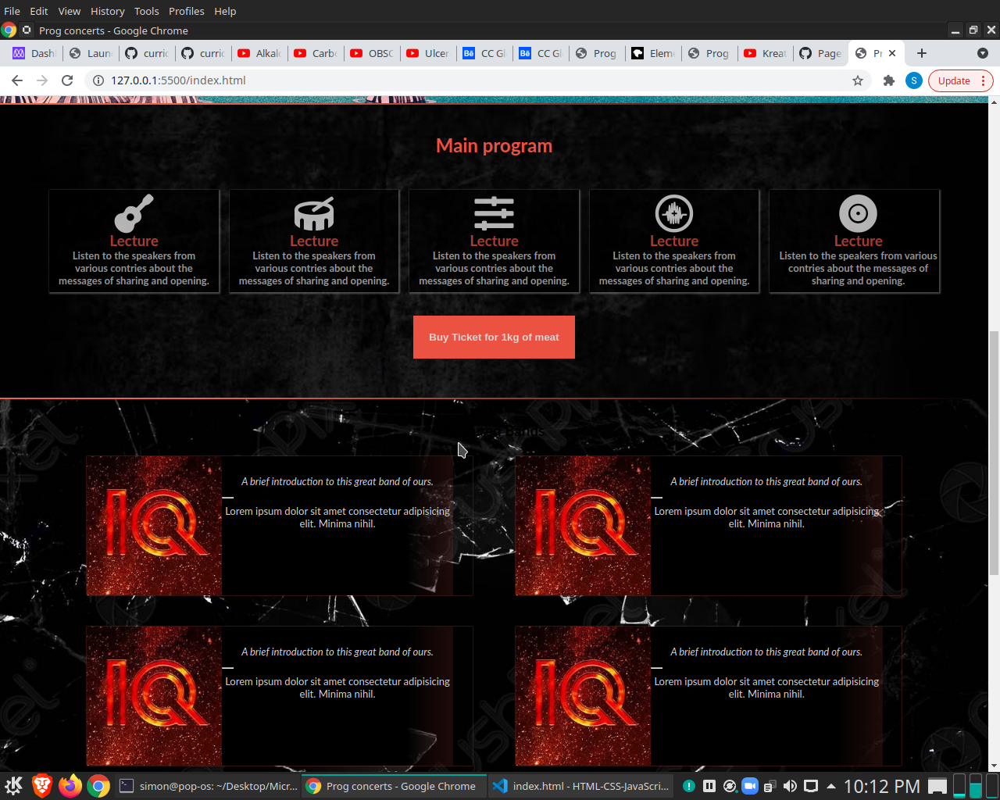
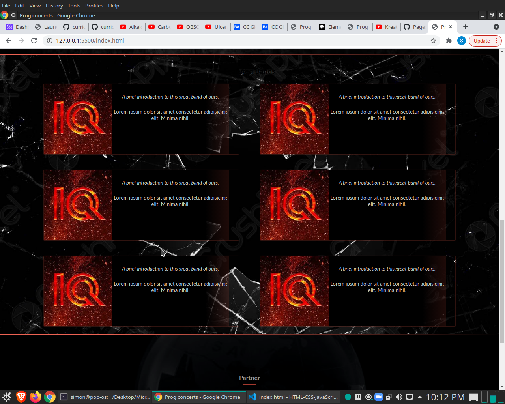
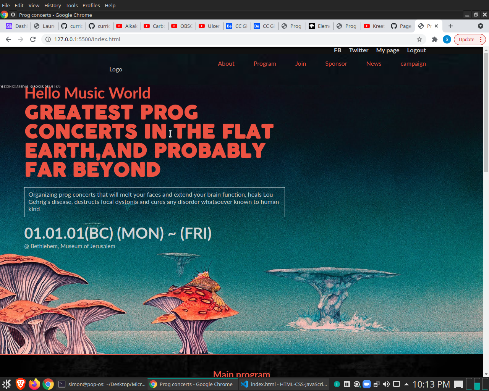

# HTML-CSS-JavaScript project

## This project is summary of our learnings of HTML/CSS and JS
  Try to recreate a template and personalize it.
  I tried to use my own designe and I think that I've done a good job

## Built With HTML5, CSS, Javascript

[Live Demo Link]( https://simongrchevski.github.io/ConcertSite/ )

## Getting Started

Clone the project from the console with command $git clone git@github.com:SimonGrchevski/HTML-CSS-JavaScript-capstone-project.git
cd into the HTML-CSS-JavaScript-capstone-project rep.
In terminal write $code .
Open the live server

## Prerequisites

    Vs code Studio
    
Authors

:bust_in_silhouette: **Simon Grcevski**

[GitHub]( https://github.com/SimonGrchevski )
[LinkedIn]( https://www.linkedin.com/in/simon-grchevski-682935209/ )

handshake Contributing Contributions, issues, and feature requests are welcome!

Show your support Give a star if you like this project!
